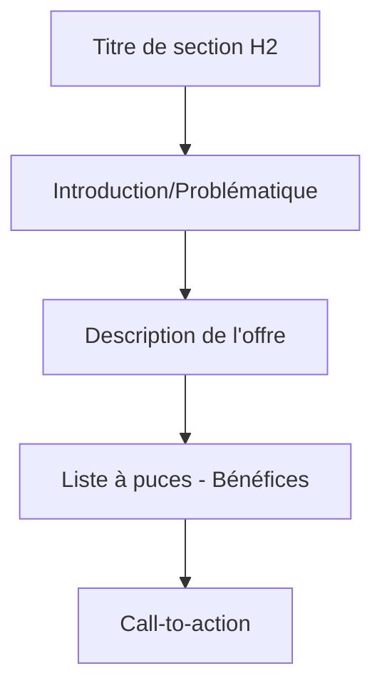

# ✏️ Guide 02 - Modification du Contenu

!!! success "🎨 Devenez autonome sur votre contenu"
    **Durée estimée :** 30 minutes
    **Niveau :** :material-star: Débutant
    **Objectif :** Maîtriser la modification de tous les éléments de votre landing page

---

## 🎯 Ce que vous allez apprendre

À la fin de ce guide, vous saurez modifier :

- [x] Les textes et titres de votre page
- [x] Les sections de services et descriptions
- [x] Les images (remplacement et optimisation)
- [x] Les témoignages clients
- [x] La section FAQ
- [x] Les call-to-actions (CTA)

---

## 📝 Modification des textes et titres

### Éditer le titre principal

!!! example "🎯 Titre actuel de votre page"
    **"L'ESSENTIEL EN SOI - LE COACHING AU FÉMININ"**

    C'est votre titre H1, le plus important pour le SEO !

=== "✏️ Modification simple"

    **Procédure en 4 étapes :**

    1. :material-cursor-default-click: **Cliquez** directement sur le titre dans l'éditeur
    2. :material-cursor-text: Le texte devient éditable (curseur clignotant)
    3. :material-keyboard: **Modifiez** le texte comme dans Word
    4. :material-check: Cliquez en dehors ou appuyez sur ++esc++ pour valider

    !!! tip "Validation rapide"
        Appuyez sur ++esc++ pour sortir du mode édition rapidement

=== "🎨 Personnalisation avancée"

    **Options disponibles dans le panneau de droite :**

    <div class="grid cards" markdown>

    -   :material-format-text: **Contenu**

        ---

        - Texte modifiable
        - Balises HTML (H1, H2, H3)

    -   :material-palette: **Style**

        ---

        - Police de caractères
        - Taille (en pixels)
        - Couleur personnalisée
        - Gras / Italique
        - Alignement (gauche, centre, droite)

    -   :material-arrow-expand-vertical: **Espacement**

        ---

        - Marge haute
        - Marge basse
        - Padding intérieur

    </div>

### Hiérarchie des titres

!!! info "📊 Structure SEO optimale"

    | Balise | Usage | Nombre | Exemple |
    |--------|-------|--------|---------|
    | **H1** | Titre principal | ==1 seul== | "L'Essentiel en Soi" |
    | **H2** | Sections majeures | 3-6 | "Accompagnements Juridiques" |
    | **H3** | Sous-sections | Illimité | "Bénéfices de l'accompagnement" |
    | **H4-H6** | Détails | Si nécessaire | Rarement utilisés |

!!! warning "⚠️ Règle d'or SEO"
    **Un seul H1 par page !** Les moteurs de recherche utilisent cette hiérarchie pour comprendre votre contenu.


### Modifier les paragraphes

**Exemple pratique :** Modifier "J'accompagne les femmes et les adolescents..."

=== "📝 Édition de texte"

    **Procédure :**

    1. :material-cursor-default-click: Cliquez sur le paragraphe
    2. :material-select: Sélectionnez le texte à modifier (comme dans Word)
    3. :material-keyboard: Tapez le nouveau texte
    4. :material-content-save: Enregistrez avec ++ctrl+s++

=== "🎨 Mise en forme"

    **Mini-barre d'outils disponible :**

    | Format | Raccourci | Icône | Usage |
    |--------|-----------|-------|-------|
    | **Gras** | ++ctrl+b++ | :material-format-bold: | Mettre en évidence |
    | **Italique** | ++ctrl+i++ | :material-format-italic: | Emphase légère |
    | **Souligné** | ++ctrl+u++ | :material-format-underline: | À éviter (confusion avec liens) |
    | **Lien** | ++ctrl+k++ | :material-link: | Créer un lien hypertexte |
    | **Liste** | - | :material-format-list-bulleted: | Liste à puces |
    | **Couleur** | - | :material-palette: | Changer la couleur du texte |

    !!! tip "💡 Astuce de mise en forme"
        Utilisez ==le gras pour les mots-clés importants== et l'*italique pour l'emphase subtile*.

    **Évitez le souligné** qui est souvent confondu avec un lien cliquable.

### Ajouter ou supprimer du texte

=== "➕ Ajouter du texte"

    **Pour ajouter un paragraphe :**

    1. :material-cursor-text: Positionnez le curseur à l'endroit souhaité
    2. ++enter++ Appuyez sur **Entrée** pour créer une nouvelle ligne
    3. :material-keyboard: Tapez votre nouveau contenu
    4. :material-content-save: Enregistrez

    !!! example "Exemple d'usage"
        Ajoutez un paragraphe d'introduction avant votre offre principale pour améliorer le contexte.

=== "➖ Supprimer du texte"

    **Suppression sélective :**

    1. :material-select: Sélectionnez le texte à supprimer
    2. ++delete++ ou ++backspace++ Appuyez sur **Suppr** ou **Backspace**
    3. :material-content-save: Enregistrez

    !!! danger "⚠️ Attention aux suppressions"
        Ne supprimez pas les blocs entiers par erreur !

    **En cas d'erreur :** ++ctrl+z++ pour annuler immédiatement

---

## 🎯 Modification des sections de services

### Structure de vos services

Votre page contient **2 sections principales** :

<div class="grid cards" markdown>

-   :material-gavel: **Accompagnements Juridiques**

    ---

    Services liés aux aspects juridiques :
    - Problématiques légales
    - Accompagnement spécialisé
    - Liste des bénéfices

-   :material-heart: **Accompagnements "Essentiel en soi"**

    ---

    Services de développement personnel :
    - Coaching individuel
    - Accompagnement transformation
    - Bénéfices personnels

</div>

### Éditer les titres de sections

!!! example "📝 Exemple : Modifier "ACCOMPAGNEMENTS JURIDIQUES""

    **Procédure :**

    1. :material-cursor-default-click: Cliquez sur le titre de section
    2. :material-menu: Le panneau de droite affiche les propriétés
    3. :material-pencil: Modifiez :
        - Le texte du titre
        - La couleur (généralement un accent de votre charte)
        - La taille de police (recommandé : 32-48px pour H2)
        - L'alignement (centré recommandé pour les sections)

### Modifier les descriptions de services

**Structure type d'une section :**



=== "✏️ Éditer le texte"

    **Pour modifier la description :**

    1. Cliquez sur le paragraphe
    2. Éditez le contenu
    3. Structurez avec des phrases courtes
    4. Enregistrez

=== "📝 Modifier la liste à puces"

    **Ajouter un élément :**

    1. :material-cursor-text: Placez le curseur en fin de ligne
    2. ++enter++ Appuyez sur **Entrée**
    3. :material-keyboard: Tapez le nouvel élément
    4. :material-content-save: Enregistrez

    **Supprimer un élément :**

    1. :material-select: Sélectionnez la ligne entière
    2. ++delete++ Appuyez sur **Suppr**

    !!! tip "✅ Bonnes pratiques pour les listes"

        **À faire :**

        - ✅ Maximum **5-7 points** par liste
        - ✅ Phrases **courtes et percutantes**
        - ✅ Commencez par un **verbe d'action**
        - ✅ Utilisez des **mots-clés** importants

        **À éviter :**

        - ❌ Phrases trop longues (> 15 mots)
        - ❌ Jargon technique incompréhensible
        - ❌ Listes interminables (> 10 points)

### Ajouter une nouvelle section de service

!!! example "➕ Créer un nouveau service"

    **Procédure :**

    1. :material-plus-circle: Cliquez sur le **"+"** entre deux blocs
    2. :material-view-module: Choisissez **"Section"** ou **"Bloc de contenu"**
    3. :material-content-copy: Sélectionnez un modèle similaire à vos sections existantes
    4. :material-pencil: Remplissez le contenu :
        - Titre de la section
        - Description
        - Liste des bénéfices
        - CTA spécifique
    5. :material-content-save: Enregistrez

**Idéal pour :** Lancer une nouvelle offre ou service complémentaire

---

## 🖼️ Modification des images

### Remplacer l'image principale

!!! info "📸 Image actuelle"
    Photo d'Armelle Bodénès (photo de profil professionnelle)

=== "📤 Télécharger depuis votre ordinateur"

    **Procédure complète :**

    1. :material-cursor-default-click: **Cliquez sur l'image** à modifier
    2. :material-image: Dans le panneau de droite, cliquez sur **"Changer l'image"**
    3. :material-upload: Sélectionnez **"Télécharger"**
    4. :material-folder: Naviguez dans vos fichiers
    5. :material-check: Sélectionnez l'image et cliquez **"Ouvrir"**
    6. :material-loading: L'image est automatiquement uploadée

    !!! success "✅ Upload réussi"
        L'image apparaît immédiatement dans votre éditeur !

=== "📚 Depuis la bibliothèque"

    **Utiliser des images déjà uploadées :**

    1. :material-cursor-default-click: Cliquez sur l'image
    2. :material-image: Cliquez sur **"Changer l'image"**
    3. :material-folder-image: Sélectionnez **"Bibliothèque"**
    4. :material-view-grid: Parcourez vos images existantes
    5. :material-check-circle: Cliquez sur l'image souhaitée
    6. :material-import: Cliquez sur **"Insérer"**

    !!! tip "Avantage"
        Réutilisez vos images sans re-uploader !

### Critères de qualité des images

!!! warning "📊 Formats et tailles recommandés"

    | Type d'image | Format | Dimensions optimales | Poids max | Usage |
    |--------------|--------|---------------------|-----------|-------|
    | **Photo principale** | JPG | 1200x800px | ==200 Ko== | Header, hero |
    | **Photo de profil** | JPG/PNG | 600x600px | ==100 Ko== | À propos, équipe |
    | **Illustrations** | PNG | Variable | ==150 Ko== | Icônes, graphismes |
    | **Logos** | SVG/PNG | 200x200px | ==50 Ko== | Logo, favicons |

### Optimisation des images

!!! danger "🐌 Images trop lourdes = Page lente"
    **Conséquences des images non optimisées :**

    - ❌ Temps de chargement > 5 secondes
    - ❌ Mauvais référencement Google
    - ❌ Taux de rebond élevé
    - ❌ Expérience mobile catastrophique

**Outils gratuits recommandés :**

<div class="grid cards" markdown>

-   :material-image-size-select-small: **[TinyPNG](https://tinypng.com)**

    ---

    **Gratuit**

    - Compression intelligente
    - Sans perte de qualité
    - Drag & drop simple
    - Jusqu'à 5 Mo par image

    [:octicons-arrow-right-24: Accéder](https://tinypng.com){ .md-button }

-   :material-google: **[Squoosh](https://squoosh.app)**

    ---

    **Gratuit - Google**

    - Interface avancée
    - Comparaison avant/après
    - Multiples formats
    - Compression personnalisée

    [:octicons-arrow-right-24: Accéder](https://squoosh.app){ .md-button }

-   :material-apple: **[ImageOptim](https://imageoptim.com)**

    ---

    **Gratuit - Mac uniquement**

    - Application native
    - Batch processing
    - Métadonnées nettoyées
    - Ultra-rapide

    [:octicons-arrow-right-24: Accéder](https://imageoptim.com){ .md-button }

</div>

!!! example "📋 Processus d'optimisation type"

    **Workflow recommandé :**

    1. :material-camera: Prenez/récupérez votre photo
    2. :material-crop: Recadrez aux bonnes dimensions (Canva, Photoshop)
    3. :material-compress: Compressez avec TinyPNG
    4. :material-check: Vérifiez le poids final (< 200 Ko)
    5. :material-upload: Uploadez sur Systeme.io

**Gain :** Jusqu'à -70% de poids sans perte visuelle !

### Paramètres de l'image

Une fois l'image insérée, **configurez ces paramètres essentiels** :

=== "📐 Dimensions"

    **Réglages de taille :**

    | Paramètre | Valeur recommandée | Effet |
    |-----------|-------------------|-------|
    | **Largeur** | 100% | Pleine largeur du conteneur |
    | **Hauteur** | Auto | Proportion conservée |
    | **Ajustement** | Cover | Remplit l'espace sans déformation |

    !!! info "Options d'ajustement"
        - **Cover** : Remplit le cadre (recommandé)
        - **Contain** : Image entière visible
        - **Fill** : Étire l'image (éviter)

=== "♿ Accessibilité"

    **Texte alternatif (Alt text) - CRUCIAL !**

    Le texte alternatif décrit l'image pour :

    - :material-google: **Les moteurs de recherche** (SEO)
    - :material-account-voice: **Les lecteurs d'écran** (accessibilité)
    - :material-image-off: **L'affichage** si l'image ne charge pas

    !!! example "✅ Exemples de bons textes alternatifs"

        | Image | ❌ Mauvais Alt | ✅ Bon Alt |
        |-------|---------------|-----------|
        | Photo profil | "photo" | "Armelle Bodénès, coach certifiée ICF spécialisée en coaching féminin" |
        | Image service | "image1" | "Séance de coaching individuel en visioconférence" |
        | Illustration | "img" | "Accompagnement ménopause et image de soi - L'Essentiel en Soi" |

    !!! danger "🚫 Alt text à éviter"
        - "image", "photo", "img"
        - Répétition du nom de fichier
        - Description trop longue (> 125 caractères)
        - Bourrage de mots-clés

=== "🔗 Lien (optionnel)"

    **Rendre une image cliquable :**

    1. Dans les propriétés, section **"Lien"**
    2. Collez l'URL de destination
    3. Cochez **"Ouvrir dans un nouvel onglet"** si externe
    4. Enregistrez

    **Cas d'usage :**
    - Galerie photo → agrandissement
    - Logo partenaire → site partenaire
    - Certification → page détails

    ### Ajouter une nouvelle image

    !!! example "➕ Insérer une image dans une section"

        **Procédure :**

        1. :material-plus-circle: Cliquez sur le **"+"** où vous voulez l'ajouter
        2. :material-image: Sélectionnez **"Image"**
        3. :material-upload: Téléchargez ou choisissez depuis la bibliothèque
        4. :material-resize: Ajustez la taille et l'alignement
        5. :material-content-save: Enregistrez

---

## 💬 Modification des témoignages

### Structure des témoignages actuels

Vous avez **2 témoignages clients** :

<div class="grid cards" markdown>

-   :material-account-circle: **Patricia**

    ---

    Témoignage sur la transformation personnelle

    *"Lorsque j'ai démarré mes séances j'étais au 36e dessous..."*

-   :material-account-circle: **Rilinda**

    ---

    Retour d'expérience positif

    Témoignage sur les résultats obtenus

</div>

### Anatomie d'un témoignage

!!! info "🏗️ Structure type"

    ```
    ┌───────────────────────────────────┐
    │ 💬 [Citation du témoignage]       │
    │                                   │
    │ "Lorsque j'ai démarré mes         │
    │ séances j'étais au 36e dessous.   │
    │ Aujourd'hui, je me sens..."       │
    │                                   │
    │ — PATRICIA                        │
    │   [Titre/Contexte optionnel]     │
    │                                   │
    │ 📸 [Photo optionnelle]            │
    └───────────────────────────────────┘
    ```

### Modifier un témoignage existant

=== "✏️ Éditer le contenu"

    **Procédure :**

    1. :material-cursor-default-click: Cliquez sur le bloc témoignage
    2. :material-format-quote-open: Modifiez le texte de la citation
    3. :material-account: Changez le nom si nécessaire
    4. :material-briefcase: Ajoutez un titre/contexte (ex: "Cliente depuis 2 ans")
    5. :material-content-save: Enregistrez

=== "📸 Changer la photo"

    **Ajouter ou modifier la photo du client :**

    1. Cliquez sur la photo du témoignage
    2. Suivez le même processus que la [section images](#modification-des-images)
    3. Choisissez une photo professionnelle et souriante
    4. Ajoutez un Alt text : "Photo de [Prénom], cliente satisfaite"

    !!! tip "✅ Conseils pour des témoignages impactants"

        **Caractéristiques d'un bon témoignage :**

        | Critère | Description | Exemple |
        |---------|-------------|---------|
        | :material-account-heart: **Authenticité** | Langage naturel du client | "Au début, j'avais peur..." |
        | :material-target: **Spécificité** | Résultats concrets mesurables | "J'ai retrouvé confiance en 3 mois" |
        | :material-text: **Longueur** | 3-5 phrases, 80-150 mots max | Ni trop court, ni trop long |
        | :material-arrow-up-bold: **Transformation** | Avant → Après visible | "J'étais... Maintenant je..." |
        | :material-emoticon-happy: **Émotion** | Ressenti authentique | "Je me sens enfin moi-même" |

        **À éviter absolument :**
        - ❌ Trop générique ("très bien", "super", "top")
        - ❌ Trop long (> 200 mots = illisible)
        - ❌ Pas de résultat concret
        - ❌ Langage trop formel ou commercial

### Ajouter un nouveau témoignage

!!! example "➕ Insérer un témoignage supplémentaire"

    **Procédure :**

    1. :material-map-marker-radius: Localisez la **section des témoignages**
    2. :material-plus-circle: Cliquez sur le **"+"** après le dernier témoignage
    3. :material-format-quote-open: Cherchez **"Bloc témoignage"** ou **"Citation"**
    4. :material-content-copy: Sélectionnez le modèle similaire aux existants
    5. :material-pencil: Remplissez le contenu :
        - Citation du client
        - Prénom (ou initiales pour confidentialité)
        - Contexte (âge, situation, durée accompagnement)
        - Photo (optionnelle mais recommandée)
    6. :material-content-save: Enregistrez

!!! warning "📊 Nombre de témoignages optimal"
    **Recommandation :** Conservez entre **3 et 6 témoignages**

    - **Moins de 3** : Manque de crédibilité
    - **Plus de 6** : Dilution de l'impact
    - **Optimal : 4-5** témoignages variés

### Supprimer un témoignage

!!! danger "🗑️ Suppression d'un témoignage"

    **Procédure :**

    1. :material-cursor-default-click: Cliquez sur le bloc témoignage
    2. :material-delete: Cliquez sur l'icône **corbeille** 🗑️ (en haut à droite du bloc)
    3. :material-alert: Une fenêtre de confirmation apparaît
    4. :material-check: Confirmez la suppression
    5. :material-content-save: Enregistrez

!!! warning "⚠️ Important"
    Conservez **toujours au moins 2 témoignages** pour maintenir la crédibilité sociale.

---

---

## ❓ Modification de la section FAQ

### Structure de la FAQ actuelle

Vous avez **4 questions-réponses** :

1. :material-clock: Durée d'un accompagnement
2. :material-account-group: Public cible
3. :material-cash: Séance vs Forfait
4. :material-help-circle: Manque de clarté sur les besoins

### Modifier une question/réponse

=== "✏️ Éditer le contenu"

    **Procédure :**

    1. :material-cursor-default-click: Cliquez sur la question à modifier
    2. :material-chevron-down: Le bloc FAQ s'ouvre (système accordéon)
    3. :material-pencil: Modifiez :
        - **Question** : Cliquez sur le titre
        - **Réponse** : Cliquez sur le contenu déplié
    4. :material-content-save: Enregistrez

    !!! tip "Double-clic rapide"
        Double-cliquez directement sur le texte pour un accès rapide à l'édition

=== "🎨 Personnaliser le style"

    **Options de personnalisation :**

    - Couleur de fond de la question
    - Icône d'ouverture/fermeture
    - Police et taille du texte
    - Espacement entre les questions

    !!! tip "✅ Bonnes pratiques FAQ"

        **Pour des FAQ efficaces :**

        | Principe | Description | Exemple |
        |----------|-------------|---------|
        | :material-account-voice: **Questions claires** | Formulées comme vos clients les posent | "Combien coûte une séance ?" |
        | :material-text-short: **Réponses concises** | 2-4 phrases maximum | 50-100 mots |
        | :material-sort-numeric-ascending: **Ordre logique** | Questions fréquentes d'abord | Prix, durée, modalités |
        | :material-shield-check: **Réassurance** | Levez les objections | "C'est normal si..." |
        | :material-lightbulb: **Clarté** | Langage simple et accessible | Pas de jargon |

        **À éviter :**
        - ❌ Jargon technique incompréhensible
        - ❌ Réponses vagues ou évasives
        - ❌ Trop de questions (> 8)
        - ❌ Questions sans intérêt

### Ajouter une nouvelle question

!!! example "➕ Créer une nouvelle question FAQ"

    **Procédure :**

    1. :material-map-marker-radius: Localisez la **section FAQ**
    2. :material-plus-circle: Cliquez sur **"Ajouter une question"** (bouton spécifique au bloc FAQ)
    3. :material-help-circle: Rédigez la question
    4. :material-text: Rédigez la réponse (concise !)
    5. :material-content-save: Enregistrez

**Exemples de questions pertinentes à ajouter :**

!!! example "💡 Suggestions de questions FAQ"

    - :material-map-marker: "Les séances se déroulent-elles en présentiel ou en visio ?"
    - :material-currency-eur: "Quel est le tarif d'une séance découverte ?"
    - :material-calendar: "Comment se déroule la prise de rendez-vous ?"
    - :material-account-child: "À partir de quel âge accompagnez-vous les adolescents ?"
    - :material-credit-card: "Quels sont les moyens de paiement acceptés ?"
    - :material-phone: "Comment puis-je vous contacter ?"

### Réorganiser les questions

!!! tip "🔄 Changer l'ordre des questions"

    **Procédure glisser-déposer :**

    1. :material-cursor-default-click: Cliquez sur la question à déplacer
    2. :material-drag: Utilisez l'icône **déplacer** ⋮⋮ (qui apparaît au survol)
    3. :material-arrow-all: Glissez-déposez à la nouvelle position
    4. :material-check: La question se repositionne automatiquement
    5. :material-content-save: Enregistrez

    **Ordre recommandé :**
    1. Questions sur les tarifs (le plus demandé)
    2. Questions sur les modalités pratiques
    3. Questions sur le processus
    4. Questions sur les résultats

---

## 🎯 Modification des Call-to-Actions (CTA)

### Identifier vos CTA actuels

!!! info "🔘 CTA principaux sur votre page"

    1. :material-calendar-check: **"Réservez votre séance découverte gratuite"** (bouton principal)
    2. :material-link: Liens Calendly intégrés dans le texte
    3. :material-phone: Boutons de contact secondaires

### Modifier le texte d'un bouton CTA

=== "✏️ Éditer le texte"

    **Procédure :**

    1. :material-cursor-default-click: Cliquez sur le bouton
    2. :material-menu: Dans le panneau de droite, section **"Texte"**
    3. :material-pencil: Modifiez le texte du bouton
    4. :material-content-save: Enregistrez

    !!! warning "⚠️ Ne touchez pas au lien Calendly"
        La modification du lien est couverte dans le [Guide 03 - Gestion des CTA et Calendly](03-GESTION-CTA-CALENDLY.md)

=== "🎨 Personnaliser le style"

    **Options disponibles :**

    <div class="grid cards" markdown>

    -   :material-palette: **Couleur**

        ---

        - Couleur du bouton
        - Couleur du texte
        - Contraste important !

    -   :material-resize: **Taille**

        ---

        - **Grand** : CTA principal (1 seul)
        - **Moyen** : CTA secondaires
        - **Petit** : Footer, en-tête

    -   :material-shape: **Forme**

        ---

        - **Arrondie** : Doux, accueillant
        - **Carrée** : Professionnel
        - **Pilule** : Moderne, dynamique

    </div>

    !!! tip "✅ Bonnes pratiques pour les textes de CTA"

        **Transformation des CTA génériques :**

        | ❌ À éviter | ✅ À privilégier | Pourquoi |
        |-----------|----------------|----------|
        | "Cliquez ici" | "Réservez votre séance gratuite" | Spécifique et bénéfice clair |
        | "En savoir plus" | "Découvrir l'accompagnement" | Action précise |
        | "Valider" | "Je réserve ma séance découverte" | 1ère personne = engagement |
        | "Soumettre" | "Je prends rendez-vous maintenant" | Urgence douce |
        | "OK" | "Oui, je veux être accompagné(e)" | Désir exprimé |

        **Principes d'un CTA efficace :**

        1. :material-run: **Verbe d'action** à la 1ère personne ("Je réserve", "Je découvre")
        2. :material-gift: **Bénéfice clair** ("gratuite", "sans engagement", "offerte")
        3. :material-clock-fast: **Urgence douce** ("maintenant", "aujourd'hui") sans être agressif
        4. :material-target: **Spécificité** au contexte de la section

### Design du bouton

!!! warning "🎨 Règles de design des CTA"

    **Couleur :**
    - ✅ Contraste fort avec le fond (ratio 4.5:1 minimum)
    - ✅ Couleur accent de votre charte graphique
    - ✅ Testez la visibilité sur mobile
    - ❌ Évitez le gris (= désactivé dans l'esprit des utilisateurs)

    **Taille et hiérarchie :**

    | Type CTA | Taille | Nombre | Placement |
    |----------|--------|--------|-----------|
    | **Principal** | Grand | 1 seul | Above the fold + fin de page |
    | **Secondaire** | Moyen | 2-3 | Milieu de page |
    | **Tertiaire** | Petit | Illimité | Footer, navigation |

    **Forme recommandée pour le coaching :**
    - :material-checkbox-blank-circle: **Arrondie** (20-30px border-radius) = Doux, accueillant, moderne
    - Évitez les formes trop carrées = trop corporate/froid

---

## ✅ Checklist de modification de contenu

### Avant de publier vos modifications

=== "📝 Vérifications textuelles"

    **Relecture complète :**

    - [ ] :material-spellcheck: Aucune faute d'orthographe (utilisez un correcteur)
    - [ ] :material-format-text: Ponctuation correcte (virgules, points)
    - [ ] :material-format-header-pound: Titres cohérents et hiérarchisés (H1, H2, H3)
    - [ ] :material-text-short: Phrases courtes et claires (< 20 mots)
    - [ ] :material-account-voice: Ton uniforme (tutoiement OU vouvoiement)
    - [ ] :material-target: Call-to-actions percutants et cohérents
    - [ ] :material-link: Tous les liens fonctionnels

=== "🖼️ Vérifications visuelles"

    **Qualité des médias :**

    - [ ] :material-file-image: Images optimisées (poids < 200 Ko chacune)
    - [ ] :material-tag-text: Textes alternatifs (Alt) remplis systématiquement
    - [ ] :material-quality-high: Images de qualité professionnelle (nettes, bien cadrées)
    - [ ] :material-palette: Cohérence visuelle (couleurs de votre charte)
    - [ ] :material-format-align-center: Alignement cohérent
    - [ ] :material-emoticon-happy: Photos souriantes et accueillantes

=== "🔧 Vérifications techniques"

    **Tests fonctionnels :**

    - [ ] :material-link-variant: Tous les liens testés (clic sur chacun)
    - [ ] :material-cursor-default-click: Boutons CTA cliquables et fonctionnels
    - [ ] :material-cellphone: Page responsive (vue mobile + tablette)
    - [ ] :material-speedometer: Temps de chargement < 3 secondes
    - [ ] :material-reload: Test sur différents navigateurs (Chrome, Safari, Firefox)
    - [ ] :material-web: Vérification en navigation privée (cache vide)

### Workflow de publication

!!! success "🚀 Processus recommandé"

    ```mermaid
    graph LR
        A[1. Modifier] --> B[2. Enregistrer]
        B --> C[3. Checklist]
        C --> D{Tout OK ?}
        D -->|Non| A
        D -->|Oui| E[4. Aperçu]
        E --> F[5. Test mobile]
        F --> G{Parfait ?}
        G -->|Non| A
        G -->|Oui| H[6. Publier]
        H --> I[7. Vérifier en ligne]
    ```

**Temps estimé :** 10-15 minutes pour une validation complète

---

## 🎓 Astuces avancées

### Copier-coller de contenu externe

!!! warning "⚠️ Problème de formatage"
    Copier du texte depuis **Word/Google Docs** peut casser le formatage !

**Solution en 4 étapes :**

=== "🔄 Méthode nettoyage"

    1. :material-content-copy: Copiez votre texte depuis Word/Docs
    2. :material-file-document: Collez dans un **éditeur de texte brut** :
        - Windows : Notepad (Bloc-notes)
        - Mac : TextEdit (mode texte)
        - En ligne : [TextCleanr](https://textcleanr.com)
    3. :material-content-copy: Recopiez depuis l'éditeur de texte brut
    4. :material-content-paste: Collez dans Systeme.io
    5. :material-format-text: Reformatez manuellement (gras, titres, etc.)

=== "⚡ Raccourci clavier"

    **Coller sans formatage :**

    - Windows : ++ctrl+shift+v++
    - Mac : ++cmd+shift+v++

    Colle le texte brut directement !

    ### Rechercher/Remplacer du texte

    !!! info "🔍 Fonction de recherche"

        **Pour modifier un mot sur toute la page :**

        1. ++ctrl+f++ Ouvrez la recherche
        2. :material-magnify: Tapez le mot à chercher
        3. :material-pencil: Modifiez manuellement chaque occurrence
        4. :material-arrow-down: Naviguez avec les flèches Suivant/Précédent

    !!! warning "Limitation Systeme.io"
        Pas de fonction "Remplacer tout" native. Modification manuelle nécessaire.

    ### Dupliquer une section

    !!! tip "📋 Gagner du temps avec la duplication"

        **Pour sections similaires (services, témoignages...) :**

        1. :material-cursor-default-click: Cliquez sur le bloc à dupliquer
        2. :material-content-copy: Cliquez sur l'icône **"Dupliquer"** 📋
        3. :material-arrow-down: La copie apparaît juste en dessous
        4. :material-pencil: Modifiez le contenu de la copie
        5. :material-content-save: Enregistrez

        **Idéal pour :**
        - Ajouter un nouveau service similaire
        - Dupliquer un témoignage pour en ajouter un autre
        - Répéter une structure de section

---

## ⚠️ Erreurs courantes à éviter

!!! danger "🚫 Top 6 des erreurs à ne PAS commettre"

    | Erreur | Conséquence | Solution |
    |--------|-------------|----------|
    | :material-content-save-off: **Ne pas enregistrer régulièrement** | Perte de modifications | ++ctrl+s++ **toutes les 5 min** |
    | :material-publish-off: **Publier sans tester** | Erreurs visibles publiquement | **Toujours** faire un aperçu complet |
    | :material-weight-lifter: **Images trop lourdes** | Page lente, mauvais SEO | Optimiser < 200 Ko avec TinyPNG |
    | :material-tag-off: **Oublier les Alt texts** | Mauvais SEO, accessibilité | Remplir **systématiquement** |
    | :material-cursor-default: **CTA peu clair** | Faible taux de conversion | Verbe d'action + bénéfice |
    | :material-format-font: **Trop de polices** | Design non professionnel | Maximum **2-3 polices** |

---

## 🎓 Exercice pratique

### Mission : Mettre à jour votre page

!!! example "🎯 Exercice guidé complet"

    **Objectif :** Appliquer toutes les compétences acquises

    **Étape 1 : Modifier un titre** (5 min)

    - [ ] Changez un sous-titre de service (H2)
    - [ ] Testez la taille 36px puis 42px
    - [ ] Choisissez la meilleure
    - [ ] Enregistrez avec ++ctrl+s++

    **Étape 2 : Remplacer une image** (10 min)

    - [ ] Choisissez une photo à remplacer
    - [ ] Optimisez-la avec [TinyPNG](https://tinypng.com)
    - [ ] Uploadez-la sur Systeme.io
    - [ ] Ajoutez un Alt text descriptif et pertinent
    - [ ] Vérifiez le rendu mobile

    **Étape 3 : Ajouter une question FAQ** (5 min)

    - [ ] Créez une nouvelle question pertinente
    - [ ] Rédigez une réponse claire (2-3 phrases)
    - [ ] Placez-la au bon endroit (ordre logique)
    - [ ] Enregistrez

    **Étape 4 : Tester la page** (5 min)

    - [ ] Aperçu Desktop : vérifiez tout
    - [ ] Aperçu Mobile : testez la navigation
    - [ ] Cliquez sur tous les boutons CTA
    - [ ] Vérifiez les images chargées

    **Étape 5 : Publier** (2 min)

    - [ ] Si tout est OK, cliquez sur **Publier**
    - [ ] Visitez l'URL publique dans un nouvel onglet
    - [ ] Faites un dernier contrôle
    - [ ] ++ctrl+f5++ Videz le cache si besoin

??? success "✅ Validation"
    **Bravo !** Vous maîtrisez maintenant la modification de contenu. 🎉

**Prochaine étape :** [Guide 03 - Gestion des CTA et Calendly](03-GESTION-CTA-CALENDLY.md)

---

## 🆘 Problèmes courants

??? question "❌ Le texte ne se modifie pas quand je clique"

    **Solutions possibles :**

    1. :material-cursor-default-click-outline: Essayez de **double-cliquer** sur le texte
    2. :material-pencil: Cliquez sur l'icône **"crayon"** ✏️ dans la barre d'outils du bloc
    3. :material-refresh: Rafraîchissez la page (++f5++) et réessayez
    4. :material-web: Testez dans un autre navigateur (Chrome recommandé)
    5. :material-shield-off: Désactivez temporairement les extensions de navigateur

    **Toujours un problème ?** Contactez le support Systeme.io

??? question "🖼️ Mon image est déformée après l'upload"

    **Diagnostic et solution :**

    **Cause :** Mauvais paramètre d'ajustement

    **Solution :**

    1. Cliquez sur l'image déformée
    2. Panneau de droite → Section **"Ajustement"**
    3. Testez ces options :
        - **Cover** : Remplit l'espace (recommandé)
        - **Contain** : Image entière visible
        - **Fill** : Étire (éviter)
    4. Choisissez **Cover** dans la plupart des cas
    5. Si toujours déformé : recadrez l'image avant upload (ratio 16:9 ou 4:3)

??? question "🗑️ J'ai supprimé un bloc par erreur"

    **Récupération d'urgence :**

    1. :material-undo: **IMMÉDIATEMENT** : ++ctrl+z++ pour annuler
    2. :material-check: Vérifiez que le bloc est revenu
    3. :material-content-save: Enregistrez tout de suite

    **Si vous avez déjà quitté l'éditeur :**
    - ❌ Systeme.io ne garde pas d'historique de versions
    - 💬 Contactez votre développeur si le bloc était complexe
    - 🔄 Sinon, recréez le bloc à partir de zéro

    !!! tip "Prévention"
        Faites des **captures d'écran** de vos sections importantes avant modifications majeures !

??? question "🚫 Les modifications n'apparaissent pas en ligne"

    **Checklist de dépannage :**

    1. :material-publish: Avez-vous bien cliqué sur **"Publier"** (pas juste Enregistrer) ?
    2. :material-timer: Attendez **30-60 secondes** après publication
    3. :material-refresh: Videz le cache : ++ctrl+f5++ (Windows) ou ++cmd+shift+r++ (Mac)
    4. :material-incognito: Testez en **navigation privée** (++ctrl+shift+n++)
    5. :material-web: Testez sur un **autre appareil** ou réseau

    **Toujours invisible ?**
    - Vérifiez que vous êtes sur la bonne URL
    - Contactez le support Systeme.io

---

## 🎉 Félicitations !

!!! success "🏆 Vous avez terminé le Guide 02"

    **Compétences acquises :**

    - ✅ Modification de textes et titres
    - ✅ Gestion des images (upload, optimisation, Alt text)
    - ✅ Édition des témoignages
    - ✅ Gestion de la FAQ
    - ✅ Personnalisation des CTA
    - ✅ Workflow de publication professionnel

---

## 🚀 Prochaine étape

Maintenant que vous maîtrisez le contenu, découvrez comment gérer vos call-to-actions et Calendly !

**Vous allez apprendre à :**

- 🔘 Optimiser vos boutons CTA
- 📅 Configurer Calendly
- 🔗 Gérer les liens de réservation
- 📊 Suivre les conversions

[Guide 03 - Gestion des CTA et Calendly →](03-GESTION-CTA-CALENDLY.md){ .md-button .md-button--primary }

[← Retour au Guide 01](01-GUIDE-DEMARRAGE-RAPIDE.md){ .md-button }

[Retour à l'accueil](index.md){ .md-button }