# ✏️ Guide 02 - Modification du Contenu

!!! success "🎨 Devenez autonome sur votre contenu"
    **Durée estimée :** 30 minutes
    **Niveau :** :material-star: Débutant
    **Objectif :** Maîtriser la modification de tous les éléments de votre landing page

---

## 🎯 Ce que vous allez apprendre

À la fin de ce guide, vous saurez modifier :

- [x] Les textes et titres de votre page
- [x] Les sections de services et descriptions
- [x] Les images (remplacement et optimisation)
- [x] Les témoignages clients
- [x] La section FAQ
- [x] Les call-to-actions (CTA)

---

## 📝 Modification des textes et titres

### Éditer le titre principal

!!! example "🎯 Titre actuel de votre page"
    **"L'ESSENTIEL EN SOI - LE COACHING AU FÉMININ"**

    C'est votre titre H1, le plus important pour le SEO !

=== "✏️ Modification simple"

**Procédure en 4 étapes :**

1. :material-cursor-default-click: **Cliquez** directement sur le titre dans l'éditeur
2. :material-cursor-text: Le texte devient éditable (curseur clignotant)
3. :material-keyboard: **Modifiez** le texte comme dans Word
4. :material-check: Cliquez en dehors ou appuyez sur ++esc++ pour valider

!!! tip "Validation rapide"
    Appuyez sur ++esc++ pour sortir du mode édition rapidement

=== "🎨 Personnalisation avancée"

**Options disponibles dans le panneau de droite :**

<div class="grid cards" markdown>

-   :material-format-text: **Contenu**

    ---

    - Texte modifiable
    - Balises HTML (H1, H2, H3)

-   :material-palette: **Style**

    ---

    - Police de caractères
    - Taille (en pixels)
    - Couleur personnalisée
    - Gras / Italique
    - Alignement (gauche, centre, droite)

-   :material-arrow-expand-vertical: **Espacement**

    ---

    - Marge haute
    - Marge basse
    - Padding intérieur

</div>

### Hiérarchie des titres

!!! info "📊 Structure SEO optimale"

    | Balise | Usage | Nombre | Exemple |
    |--------|-------|--------|---------|
    | **H1** | Titre principal | ==1 seul== | "L'Essentiel en Soi" |
    | **H2** | Sections majeures | 3-6 | "Accompagnements Juridiques" |
    | **H3** | Sous-sections | Illimité | "Bénéfices de l'accompagnement" |
    | **H4-H6** | Détails | Si nécessaire | Rarement utilisés |

!!! warning "⚠️ Règle d'or SEO"
    **Un seul H1 par page !** Les moteurs de recherche utilisent cette hiérarchie pour comprendre votre contenu.


### Modifier les paragraphes

**Exemple pratique :** Modifier "J'accompagne les femmes et les adolescents..."

=== "📝 Édition de texte"

**Procédure :**

1. :material-cursor-default-click: Cliquez sur le paragraphe
2. :material-select: Sélectionnez le texte à modifier (comme dans Word)
3. :material-keyboard: Tapez le nouveau texte
4. :material-content-save: Enregistrez avec ++ctrl+s++

=== "🎨 Mise en forme"

**Mini-barre d'outils disponible :**

| Format | Raccourci | Icône | Usage |
|--------|-----------|-------|-------|
| **Gras** | ++ctrl+b++ | :material-format-bold: | Mettre en évidence |
| **Italique** | ++ctrl+i++ | :material-format-italic: | Emphase légère |
| **Souligné** | ++ctrl+u++ | :material-format-underline: | À éviter (confusion avec liens) |
| **Lien** | ++ctrl+k++ | :material-link: | Créer un lien hypertexte |
| **Liste** | - | :material-format-list-bulleted: | Liste à puces |
| **Couleur** | - | :material-palette: | Changer la couleur du texte |

!!! tip "💡 Astuce de mise en forme"
    Utilisez ==le gras pour les mots-clés importants== et l'*italique pour l'emphase subtile*.

**Évitez le souligné** qui est souvent confondu avec un lien cliquable.

### Ajouter ou supprimer du texte

=== "➕ Ajouter du texte"

**Pour ajouter un paragraphe :**

1. :material-cursor-text: Positionnez le curseur à l'endroit souhaité
2. ++enter++ Appuyez sur **Entrée** pour créer une nouvelle ligne
3. :material-keyboard: Tapez votre nouveau contenu
4. :material-content-save: Enregistrez

!!! example "Exemple d'usage"
    Ajoutez un paragraphe d'introduction avant votre offre principale pour améliorer le contexte.

=== "➖ Supprimer du texte"

**Suppression sélective :**

1. :material-select: Sélectionnez le texte à supprimer
2. ++delete++ ou ++backspace++ Appuyez sur **Suppr** ou **Backspace**
3. :material-content-save: Enregistrez

!!! danger "⚠️ Attention aux suppressions"
    Ne supprimez pas les blocs entiers par erreur !

**En cas d'erreur :** ++ctrl+z++ pour annuler immédiatement

---

## 🎯 Modification des sections de services

### Structure de vos services

Votre page contient **2 sections principales** :

<div class="grid cards" markdown>

-   :material-gavel: **Accompagnements Juridiques**

    ---

    Services liés aux aspects juridiques :
    - Problématiques légales
    - Accompagnement spécialisé
    - Liste des bénéfices

-   :material-heart: **Accompagnements "Essentiel en soi"**

    ---

    Services de développement personnel :
    - Coaching individuel
    - Accompagnement transformation
    - Bénéfices personnels

</div>

### Éditer les titres de sections

!!! example "📝 Exemple : Modifier "ACCOMPAGNEMENTS JURIDIQUES""

    **Procédure :**

    1. :material-cursor-default-click: Cliquez sur le titre de section
    2. :material-menu: Le panneau de droite affiche les propriétés
    3. :material-pencil: Modifiez :
        - Le texte du titre
        - La couleur (généralement un accent de votre charte)
        - La taille de police (recommandé : 32-48px pour H2)
        - L'alignement (centré recommandé pour les sections)

### Modifier les descriptions de services

**Structure type d'une section :**

```mermaid
graph TD
    A[Titre de section H2] --> B[Introduction/Problématique]
    B --> C[Description de l'offre]
    C --> D[Liste à puces - Bénéfices]
    D --> E[Call-to-action]
```



=== "✏️ Éditer le texte"

**Pour modifier la description :**

1. Cliquez sur le paragraphe
2. Éditez le contenu
3. Structurez avec des phrases courtes
4. Enregistrez

=== "📝 Modifier la liste à puces"

**Ajouter un élément :**

1. :material-cursor-text: Placez le curseur en fin de ligne
2. ++enter++ Appuyez sur **Entrée**
3. :material-keyboard: Tapez le nouvel élément
4. :material-content-save: Enregistrez

**Supprimer un élément :**

1. :material-select: Sélectionnez la ligne entière
2. ++delete++ Appuyez sur **Suppr**

!!! tip "✅ Bonnes pratiques pour les listes"

**À faire :**
- ✅ Maximum **5-7 points** par liste
- ✅ Phrases **courtes et percutantes**
- ✅ Commencez par un **verbe d'action**
- ✅ Utilisez des **mots-clés** importants

**À éviter :**
- ❌ Phrases trop longues (> 15 mots)
- ❌ Jargon technique incompréhensible
- ❌ Listes interminables (> 10 points)

### Ajouter une nouvelle section de service

!!! example "➕ Créer un nouveau service"

**Procédure :**

1. :material-plus-circle: Cliquez sur le **"+"** entre deux blocs
2. :material-view-module: Choisissez **"Section"** ou **"Bloc de contenu"**
3. :material-content-copy: Sélectionnez un modèle similaire à vos sections existantes
4. :material-pencil: Remplissez le contenu :
    - Titre de la section
    - Description
    - Liste des bénéfices
    - CTA spécifique
5. :material-content-save: Enregistrez

**Idéal pour :** Lancer une nouvelle offre ou service complémentaire

---

## 🖼️ Modification des images

### Remplacer l'image principale

!!! info "📸 Image actuelle"
    Photo d'Armelle Bodénès (photo de profil professionnelle)

=== "📤 Télécharger depuis votre ordinateur"

**Procédure complète :**

1. :material-cursor-default-click: **Cliquez sur l'image** à modifier
2. :material-image: Dans le panneau de droite, cliquez sur **"Changer l'image"**
3. :material-upload: Sélectionnez **"Télécharger"**
4. :material-folder: Naviguez dans vos fichiers
5. :material-check: Sélectionnez l'image et cliquez **"Ouvrir"**
6. :material-loading: L'image est automatiquement uploadée

!!! success "✅ Upload réussi"
    L'image apparaît immédiatement dans votre éditeur !

=== "📚 Depuis la bibliothèque"

**Utiliser des images déjà uploadées :**

1. :material-cursor-default-click: Cliquez sur l'image
2. :material-image: Cliquez sur **"Changer l'image"**
3. :material-folder-image: Sélectionnez **"Bibliothèque"**
4. :material-view-grid: Parcourez vos images existantes
5. :material-check-circle: Cliquez sur l'image souhaitée
6. :material-import: Cliquez sur **"Insérer"**

!!! tip "Avantage"
    Réutilisez vos images sans re-uploader !

### Critères de qualité des images

!!! warning "📊 Formats et tailles recommandés"

| Type d'image | Format | Dimensions optimales | Poids max | Usage |
|--------------|--------|---------------------|-----------|-------|
| **Photo principale** | JPG | 1200x800px | ==200 Ko== | Header, hero |
| **Photo de profil** | JPG/PNG | 600x600px | ==100 Ko== | À propos, équipe |
| **Illustrations** | PNG | Variable | ==150 Ko== | Icônes, graphismes |
| **Logos** | SVG/PNG | 200x200px | ==50 Ko== | Logo, favicons |

### Optimisation des images

!!! danger "🐌 Images trop lourdes = Page lente"
    **Conséquences des images non optimisées :**

    - ❌ Temps de chargement > 5 secondes
    - ❌ Mauvais référencement Google
    - ❌ Taux de rebond élevé
    - ❌ Expérience mobile catastrophique

**Outils gratuits recommandés :**

<div class="grid cards" markdown>

-   :material-image-size-select-small: **[TinyPNG](https://tinypng.com)**

    ---

    **Gratuit**

    - Compression intelligente
    - Sans perte de qualité
    - Drag & drop simple
    - Jusqu'à 5 Mo par image

    [:octicons-arrow-right-24: Accéder](https://tinypng.com){ .md-button }

-   :material-google: **[Squoosh](https://squoosh.app)**

    ---

    **Gratuit - Google**

    - Interface avancée
    - Comparaison avant/après
    - Multiples formats
    - Compression personnalisée

    [:octicons-arrow-right-24: Accéder](https://squoosh.app){ .md-button }

-   :material-apple: **[ImageOptim](https://imageoptim.com)**

    ---

    **Gratuit - Mac uniquement**

    - Application native
    - Batch processing
    - Métadonnées nettoyées
    - Ultra-rapide

    [:octicons-arrow-right-24: Accéder](https://imageoptim.com){ .md-button }

</div>

!!! example "📋 Processus d'optimisation type"

**Workflow recommandé :**

1. :material-camera: Prenez/récupérez votre photo
2. :material-crop: Recadrez aux bonnes dimensions (Canva, Photoshop)
3. :material-compress: Compressez avec TinyPNG
4. :material-check: Vérifiez le poids final (< 200 Ko)
5. :material-upload: Uploadez sur Systeme.io

**Gain :** Jusqu'à -70% de poids sans perte visuelle !

### Paramètres de l'image

Une fois l'image insérée, **configurez ces paramètres essentiels** :

=== "📐 Dimensions"

**Réglages de taille :**

| Paramètre | Valeur recommandée | Effet |
|-----------|-------------------|-------|
| **Largeur** | 100% | Pleine largeur du conteneur |
| **Hauteur** | Auto | Proportion conservée |
| **Ajustement** | Cover | Remplit l'espace sans déformation |

!!! info "Options d'ajustement"
    - **Cover** : Remplit le cadre (recommandé)
    - **Contain** : Image entière visible
    - **Fill** : Étire l'image (éviter)

=== "♿ Accessibilité"

**Texte alternatif (Alt text) - CRUCIAL !**

Le texte alternatif décrit l'image pour :

- :material-google: **Les moteurs de recherche** (SEO)
- :material-account-voice: **Les lecteurs d'écran** (accessibilité)
- :material-image-off: **L'affichage** si l'image ne charge pas

!!! example "✅ Exemples de bons textes alternatifs"

    | Image | ❌ Mauvais Alt | ✅ Bon Alt |
    |-------|---------------|-----------|
    | Photo profil | "photo" | "Armelle Bodénès, coach certifiée ICF spécialisée en coaching féminin" |
    | Image service | "image1" | "Séance de coaching individuel en visioconférence" |
    | Illustration | "img" | "Accompagnement ménopause et image de soi - L'Essentiel en Soi" |

!!! danger "🚫 Alt text à éviter"
    - "image", "photo", "img"
    - Répétition du nom de fichier
    - Description trop longue (> 125 caractères)
    - Bourrage de mots-clés

=== "🔗 Lien (optionnel)"

**Rendre une image cliquable :**

1. Dans les propriétés, section **"Lien"**
2. Collez l'URL de destination
3. Cochez **"Ouvrir dans un nouvel onglet"** si externe
4. Enregistrez

**Cas d'usage :**
- Galerie photo → agrandissement
- Logo partenaire → site partenaire
- Certification → page détails

### Ajouter une nouvelle image

!!! example "➕ Insérer une image dans une section"

**Procédure :**

1. :material-plus-circle: Cliquez sur le **"+"** où vous voulez l'ajouter
2. :material-image: Sélectionnez **"Image"**
3. :material-upload: Téléchargez ou choisissez depuis la bibliothèque
4. :material-resize: Ajustez la taille et l'alignement
5. :material-content-save: Enregistrez

---


## 4. Modification des témoignages

### 4.1 Structure des témoignages actuels

Vous avez 2 témoignages :

- **Patricia**
- **Rilinda**

#### Anatomie d'un témoignage :

```
┌─────────────────────────────────────┐
│ [Citation du témoignage]            │
│                                     │
│ "Lorsque j'ai démarré mes séances   │
│ j'étais au 36e dessous..."          │
│                                     │
│ — PATRICIA                          │
│                                     │
│ [Photo optionnelle]                 │
└─────────────────────────────────────┘
```

### 4.2 Modifier un témoignage existant

#### Procédure :

1. Cliquez sur le bloc témoignage
2. Modifiez le texte de la citation
3. Changez le nom si nécessaire
4. Ajoutez/modifiez la photo (même processus que section 3)

#### Conseils pour les témoignages impactants :

- ✅ **Authenticité** : Gardez le langage naturel du client
- ✅ **Spécificité** : Résultats concrets ("j'ai retrouvé confiance")
- ✅ **Longueur** : 3-5 phrases, 80-150 mots max
- ✅ **Transformation** : Avant → Après
- ❌ **Évitez** : Trop générique ("très bien", "super")

### 4.3 Ajouter un nouveau témoignage

1. Localisez la section des témoignages
2. Cliquez sur le **"+"** après le dernier témoignage
3. Cherchez **"Bloc témoignage"** ou **"Citation"**
4. Sélectionnez le modèle similaire aux existants
5. Remplissez le contenu

### 4.4 Supprimer un témoignage

1. Cliquez sur le bloc témoignage
2. Cliquez sur l'icône **corbeille** 🗑️ en haut à droite
3. Confirmez la suppression

> ⚠️ **Important :** Conservez toujours au moins 2 témoignages sur la page pour crédibilité.

---

## 5. Modification de la section FAQ

### 5.1 Structure de la FAQ actuelle

Vous avez 4 questions-réponses :

1. Durée d'un accompagnement
2. Public cible
3. Séance vs Forfait
4. Manque de clarté sur les besoins

#### Anatomie d'une question FAQ :

```
┌─────────────────────────────────────┐
│ [Q] Combien de temps dure un        │
│     accompagnement ?                │
│                                     │
│ [R] La durée dépend de vos besoins  │
│     : une séance ponctuelle...      │
└─────────────────────────────────────┘
```

### 5.2 Modifier une question/réponse existante

#### Procédure :

1. Cliquez sur la question à modifier
2. Le bloc FAQ s'ouvre (système accordéon généralement)
3. Modifiez :
    - **Question** : Cliquez sur le titre
    - **Réponse** : Cliquez sur le contenu
4. Enregistrez

#### Bonnes pratiques FAQ :

- ✅ **Questions claires** : Formulées comme vos clients les posent
- ✅ **Réponses concises** : 2-4 phrases maximum
- ✅ **Ordre logique** : Questions les plus fréquentes d'abord
- ✅ **Réassurance** : Levez les objections ("C'est normal si...")
- ❌ **Évitez** : Jargon technique, réponses vagues

### 5.3 Ajouter une nouvelle question

1. Localisez la section FAQ
2. Cliquez sur **"Ajouter une question"** (bouton spécifique au bloc FAQ)
3. Remplissez la question
4. Rédigez la réponse
5. Enregistrez

**Exemples de questions pertinentes à ajouter :**

- "Les séances se déroulent-elles en présentiel ou en visio ?"
- "Quel est le tarif d'une séance découverte ?"
- "Combien coûte un accompagnement complet ?"
- "Travaillez-vous avec les adolescents de quel âge ?"

### 5.4 Réorganiser les questions

Pour changer l'ordre :

1. Cliquez sur la question à déplacer
2. Utilisez l'icône **déplacer** ⋮⋮
3. Glissez-déposez à la nouvelle position

---

## 6. Modification des Call-to-Actions (CTA)

### 6.1 Identifier vos CTA actuels

CTA principaux sur votre page :

1. **"Réservez votre séance découverte gratuite"** (bouton principal)
2. Liens Calendly intégrés dans le texte

### 6.2 Modifier le texte d'un bouton CTA

#### Procédure :

1. Cliquez sur le bouton
2. Dans le panneau de droite :

    ```
    ┌─────────────────────────┐│ PROPRIÉTÉS DU BOUTON    │├─────────────────────────┤│ Texte                   ││ ├─ [Réservez votre...] ││ │                       ││ Style                   ││ ├─ Couleur: [■ Accent] ││ ├─ Taille: [Grand ▼]   ││ ├─ Forme: [Arrondi ▼]  ││ │                       ││ Lien                    ││ └─ URL: [calendly.com...│└─────────────────────────┘
    ```

3. Modifiez le texte
4. Ne touchez pas à l'URL Calendly (voir Guide 03)

#### Bonnes pratiques pour les textes de CTA :

|❌ À éviter|✅ À privilégier|
|---|---|
|"Cliquez ici"|"Réservez votre séance gratuite"|
|"En savoir plus"|"Découvrir l'accompagnement"|
|"Valider"|"Je réserve ma séance découverte"|
|"Soumettre"|"Je prends rendez-vous maintenant"|

**Principes d'un bon CTA :**

- ✅ Verbe d'action à la 1ère personne ("Je réserve")
- ✅ Bénéfice clair ("gratuite", "sans engagement")
- ✅ Urgent mais pas agressif ("maintenant" plutôt que "vite")
- ✅ Spécifique au contexte

### 6.3 Modifier le style du bouton

Dans les propriétés du bouton :

**Couleur :**

- Utilisez votre couleur principale (accent brand)
- Contraste fort avec le fond (accessibilité)
- Testez sur mobile

**Taille :**

- Grand : CTA principal (1 seul)
- Moyen : CTA secondaires
- Petit : CTA tertiaires (footer)

**Forme :**

- Arrondie : Moderne, doux, accueillant (recommandé pour coaching)
- Carrée : Professionnel, sérieux
- Très arrondie (pilule) : Tendance, dynamique

---

## 7. Checklist de modification de contenu

Avant de publier vos modifications :

### ✅ Vérifications textuelles

- [ ] Aucune faute d'orthographe (utilisez un correcteur)
- [ ] Ponctuation correcte
- [ ] Titres cohérents et hiérarchisés (H1, H2, H3)
- [ ] Phrases courtes et claires
- [ ] Ton uniforme (tutoiement/vouvoiement)
- [ ] Call-to-actions percutants

### ✅ Vérifications visuelles

- [ ] Images optimisées (poids < 200 Ko)
- [ ] Textes alternatifs (Alt) remplis
- [ ] Images de qualité professionnelle
- [ ] Cohérence visuelle (couleurs, styles)

### ✅ Vérifications techniques

- [ ] Liens fonctionnels (testez chaque lien)
- [ ] Boutons CTA cliquables
- [ ] Page responsive (vue mobile/tablette)
- [ ] Chargement rapide

### ✅ Workflow de publication

```
1. Modifier le contenu
   ↓
2. [Enregistrer] 💾
   ↓
3. Vérifier la checklist ci-dessus
   ↓
4. [Aperçu] 👁️ (tester sur Desktop et Mobile)
   ↓
5. Corriger si nécessaire
   ↓
6. [Publier] 🚀
```

---

## 8. Astuces avancées

### 8.1 Copier-coller de contenu externe

Si vous copiez du texte depuis Word/Google Docs :

> ⚠️ **Attention :** Le formatage peut être cassé !

**Solution :**

1. Collez dans un éditeur de texte brut (Notepad, TextEdit)
2. Recopiez depuis l'éditeur de texte
3. Collez dans Systeme.io
4. Reformatez manuellement

### 8.2 Rechercher/Remplacer du texte

Pour modifier un mot sur toute la page :

1. `Ctrl+F` (Rechercher)
2. Tapez le mot à chercher
3. Remplacez manuellement dans chaque occurrence

> 💡 Systeme.io n'a pas de fonction "Remplacer tout" native.

### 8.3 Dupliquer une section

Pour gagner du temps sur des sections similaires :

1. Cliquez sur le bloc à dupliquer
2. Cliquez sur l'icône **"Dupliquer"** 📋
3. La copie apparaît en dessous
4. Modifiez le contenu

---

## 9. Erreurs courantes à éviter

|Erreur|Conséquence|Solution|
|---|---|---|
|Ne pas enregistrer régulièrement|Perte de modifications|`Ctrl+S` toutes les 5 minutes|
|Publier sans tester|Erreurs visibles publiquement|Toujours faire un aperçu|
|Images trop lourdes|Page lente, mauvais SEO|Optimiser avant upload (< 200 Ko)|
|Oublier les Alt texts|Mauvais SEO, accessibilité|Remplir systématiquement|
|CTA peu clair|Faible conversion|Verbe d'action + bénéfice|
|Trop de polices différentes|Design non professionnel|Maximum 2-3 polices|

---

## 10. Exercice pratique

### Mission : Mettre à jour votre page

1. **Modifier un titre** :

    - Changez un sous-titre de service
    - Testez différentes tailles
    - Enregistrez
2. **Remplacer une image** :

    - Optimisez une photo (TinyPNG)
    - Uploadez-la
    - Ajoutez un Alt text pertinent
3. **Ajouter une question FAQ** :

    - Créez une nouvelle question
    - Rédigez une réponse claire
    - Enregistrez
4. **Tester la page** :

    - Aperçu Desktop
    - Aperçu Mobile
    - Vérifier tous les éléments
5. **Publier** :

    - Si tout est OK, publiez
    - Visitez la page en ligne
    - Vérifiez le résultat

---

## 🆘 Problèmes courants

**Q : Le texte ne se modifie pas quand je clique**
R : Essayez de double-cliquer, ou cliquez sur l'icône "crayon" ✏️ dans la barre d'outils

**Q : Mon image est déformée après l'upload**
R : Vérifiez le paramètre "Ajustement" (Cover/Contain/Fill) dans les propriétés

**Q : J'ai supprimé un bloc par erreur**
R : `Ctrl+Z` immédiatement pour annuler. Si vous avez quitté, contactez votre développeur

**Q : Les modifications n'apparaissent pas en ligne**
R : Videz le cache de votre navigateur (`Ctrl+F5`) ou testez en navigation privée

---

**Prochaine étape : [[Guide 03 - Gestion des CTA et Calendly]] 🎯**